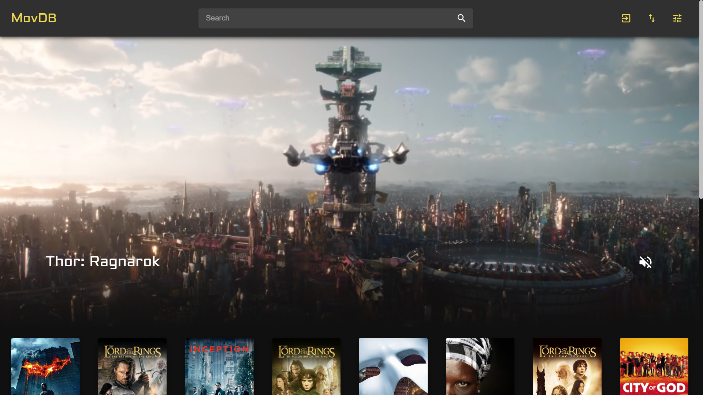

# 

# MovDB - En filmdatabaseapplikasjon

Web-applikasjonen MovDB skaffer brukere informasjon om over 2000 filmer! Gjennom søkefeltet øverst på siden, kan brukerne finne filmer ved å skrive inn nøkkelord fra filmens tittel eller beskrivelse. Deretter kan de trykke på de enkelte filmene fra resultatet av søket. Da åpnes en popup, hvor brukeren kan se filmens trailer, se hvilke produksjonsselskap som lagde den, se hvilke(t) land filmen ble spilt inn i og se lengden av filmen. Dersom brukeren er registrert på siden, og har logget inn, kan den vise hvilke filmer som er dens favoritter ved å trykke på hjerteikonet. Det totale antallet av brukere som har likt filmen vises i ved siden av ikonet. Hvis brukeren ikke leter etter én bestemt film, kan den bruke applikasjonens filtrering og sortering til å finne filmer den vil se. Mens det er mulig å sortere på rating, lengde og lanseringsdato, kan man filtrere filmer på sjangre, produksjonsselskap, lanseringsdato og lendge. For å laste inn flere filmer som passer til søket/sorteringen/filtreringen, scroller man ned til bunnen av siden.  

## Installering og kjøring

Ved å følge instruksjonene under, vil du kunne kjøre prosjektet på din lokale maskin både for utvikling og testing. 

### Forutsatte nødvendigheter

Følgende er nødvendig for å kunne kjøre prosjektet:

- [Node.js and npm](https://nodejs.org/en/download/)
- [VPN](https://innsida.ntnu.no/wiki/-/wiki/Norsk/Installere+VPN) eller direkte tilkobling til NTNUs nettverk


### Installering

#### 1 - Klon prosjektet
Åpne en terminal, og naviger til mappen du ønsker å installere prosjektet i.
Klon repoet ved å skrive: 

```
git clone https://gitlab.stud.idi.ntnu.no/it2810-h20/team-23/prosjekt-3.git
```

#### 2 - Koble til NTNUs nettverk
Koble til NTNUs nettverk enten direkte, eller gjennom VPN.

#### 3 - Installer og start backend
1. Åpne terminal

2. Fra prosjektets rotmappe, naviger til backend-mappen: 
    ``` 
    ...\prosjekt-3\movdb_backend 
    ```
    
4. Installer avhengighetene til backend med: 
    ```
    npm install
    ```
    
5. Start backend med: 
    ``` 
    node index.js
    ```

#### 4 - Installer og kjør frontend:
1. Åpne en ny terminal, men hold terminalen du brukte over åpen

2. I prosjektets rotmappe, naviger til frontend-mappen: 
    ``` 
    ...\prosjekt-3\movdb_frontend 
    ```
    
3. Installer avhengighetene til frontend med: 
    ``` 
    npm install
    ```
    
4. Start frontend med: 
    ``` 
    npm start
    ```

#### 5 - Bruk applikasjonen:
I en nettleser, gå til [localhost:3000](localhost:3000). Hvis applikasjonen er ferdig kompilert, vil forsiden av MovDB dukke opp.



## Testing

Prosjektet er end-to-end-testet med [Cypress](https://www.cypress.io/) og unit-testet med Jest.
* For å kjøre unit-testene må du navigere til frontend-mappen. Deretter skriver du:
    ``` 
    npm test
    ```

* For å kjøre end-to-end-testene må du også være i frontend-mappen. Merk at både backend og frontend må kjøre. Start testene med:
    ``` 
    npx cypress run
    ```

# Dokumentasjon

## React og TypeScript

Prosjektet er basert på Node.js og vi har brukt create-react-app for å sette opp prosjektet med Typescript som spesifisert språk. I dette prosjektet har det i stor grad blitt tatt i bruk tredjepartskomponenter for å bygge nettsiden. I hovedsak dreier dette seg om React-komponenter fra Material-UI, men også andre komponenter som ApolloClient for state management, Indiana Drag Scroll for å kunne dra for å scrolle og Infinite Scroller for pagination. 

Material-UI gjorde at vi sparte mye tid på styling og implementering av logikk for basiskomponenter. Styling for de implementerte funksjonelle komponentene ligger i .tsx-filene, da vi har tatt i bruk MakeStyles i Material-UI. Dette minner om styled-components biblioteket, og vi valgte å bruke dette fordi det er godt dokumentert og samler alt som har med en komponent å gjøre i samme fil. I tillegg blir styling basert på tilstand lettere.


## State Management

Apollo Client ble tatt i bruk for å kommunisere med backend, og dette gjorde vi via GraphQL. På samme måte som Redux, så har Apollo Client en provider som gir komponentene tilgang til en cache, der states kan lagres ved hjelp av queries. Derfor valgte vi å ikke ta i bruk Redux eller MobX i tillegg til Apollo Client, fordi dette ville vært redundant. Dette poenget argumenteres også for på Apollo sine [sider](https://www.apollographql.com/docs/tutorial/local-state/).

Grunnen til at vi valgte Apollo Client framfor Redux og MobX, var at den gjør det enkelt å håndtere både lokal og remote data samtidig gjennom samme API. Dette gjør det blant annet mulig å skrive spørringer som henter felter fra databasen og cache i samme query ved å spesifisere @client på feltene som skal hentes fra cache. En annen fordel ved å bruke Apollo Client er at den lytter på objektene i cachen. Hvis en komponent oppdaterer et av objektene, vil alle de spørringene som bruker det objektet bli kjørt på nytt for å reflektere denne endringen. Dette var veldig nyttig når vi for eksempel skulle kontrollere om menyen var åpen eller lukket, eller når filtreringen eller sorteringen endret seg. 

Hvis vi skulle ha brukt Redux ville det vært en del overhead å legge til før vi kunne ha startet å utvikle, og dette hadde kun vært for implementasjon av state management. Med Apollo fikk vi lite overhead, samt state management og håndtering av remote data.

Når det kommer til MobX har det i motsetning til Redux veldig lite overhead, og er mer effektivt fordi det kan gjøre selektiv rendering på komponenttreet. Dette vil gjøre at applikasjonen kjører mer effektiv enn den ville gjort med f.eks. Redux. Grunnen til at vi ikke valgte å bruke MobX var at vi så fordelene til Apollo som mer verdifulle enn fordelene til MobX. 


## API og database

I dette prosjektet gikk vi inn for å bruke GraphQL som spørrespråk. Dette fant vi ut at ville være veldig gunstig for oss, fordi det i mange tilfeller ville være unødvendig å hente alle feltene for en film i databasen. Et eksempel på dette er i MovieContainer. Her trengte vi kun poster, title og rating, men Movie-tabellen inneholder mange flere felter. Med GraphQL spesifiserte vi kun de feltene vi ville ha. Dette ville vært tungvint å gjøre med REST, fordi i en REST arkitektur er ressursene statiske. Dette er fordi beskrivelsen av en ressurs og hva man kan fetche er koblet sammen. I GraphQL er det omvendt: man definerer et schema, og schema sier ikke hva man får, men hva man kan få. Et annet argument for å bruke GraphQL var at REST ikke var like gunstig å bruke med Apollo, som vi gjerne ville bruke på grunn av alle fordelene nevnt i forrige avsnitt.

Vi valgte å bruke MongoDB som vår databaseløsning. Dette var fordi data i MongoDB lagres på JSON-format, og dette passer dermed bra med tanke på at vi bruker JS (Typescript). 

ApolloServer tar imot spørringene fra frontend. ApolloServer var et naturlig valg fordi vi brukte ApolloClient og GraphQL. (ApolloServer er dog også mulig å bruke sammen med f.eks. Express (REST) hvis dette er ønskelig).


## Testing

-enhetstesting
	- mocking pga. Apollo queries
	- logikk testing

End-2-end-testing er gjennomført for stort sett alle deler av nettsiden; innlasting, innlogging, registrering, se mer informasjon om filmer, like/unlike filmer, søking, sortering og filtrering. Her har vi tatt i bruk Cypress, som er et alt-i-ett rammeverk for automatisk testing som blant annet gir visuell/headless testing, assertion-bibliotek og mocking. Dette var hovedgrunnen til at vi valgte nettopp Cypress. Alt vi trengte for å gjennomføre end-2-end-testingen var inkludert og det var lite vi måtte sette oss inn i for å komme i gang.

## Git og samarbeid

På GitLab tok vi i bruk det meste av den funksjonaliteten som blir tilbudt. Med dette menes issues, branches, labels og commit-tagging for å sørge for at vi hadde god oversikt over hva som foregikk. For hver feature, og andre utviklingsoppgaver, ble det opprettet et issue med en tilsvarende WIP-branch. Dette issuet fikk relevante labels som skilte det fra andre issues. Hvis noen skulle jobbe med dette issuet tildelte de det til seg selv. Ved commit, tagget vi meldingen med issue-nummeret slik at det var tydelig at denne endringen tilhørte dette issuet. Alt dette førte til at det var tydelig hvem som jobbet på hva, og hvor langt vi hadde kommet. Vi valgte også å ta i bruk milestones fordi vi hadde flere issues som hørte sammen. Dette gjorde det enklere for gruppen å se progresjonen fra et øvre perspektiv. 

I dette prosjektet var det mange forskjellige ting som skulle gjennomføres. Dette førte til at gruppemedlemmene ble gode på sine egne ting, og at man i starten ble stuck i sine “roller”. For å fikse dette satte vi fokus på å lære opp hverandre i det man hadde gjort slik at de som hadde gjort mye frontend fikk innføring i backend og omvendt. Dette førte til at gruppen ble mer effektiv fordi medlemmene kunne fullføre den fullstendige stacken til en utviklingsoppgave.

# Verktøy og tredjepartskomponenter

* [React](https://reactjs.org/)
* [Material-UI](https://material-ui.com/)
* [Apollo Client](https://www.apollographql.com/docs/react/)
* [GraphQL](https://graphql.org/)
* [Apollo Server](https://www.apollographql.com/docs/apollo-server/)
* [MongoDB](https://www.mongodb.com/)
* [React Indiana Drag Scroll](https://www.npmjs.com/package/react-indiana-drag-scroll)
* [React Infinite Scroller](https://www.npmjs.com/package/react-infinite-scroller)

# Bidragsytere
* **Aleksander** - aleksawk@stud.ntnu.no - Gitlab: [aleksawk](https://gitlab.stud.idi.ntnu.no/aleksawk)
* **Runar** - runarsae@stud.ntnu.no - Gitlab: [runarsae](https://gitlab.stud.idi.ntnu.no/runarsae)
* **Erlend** - erlenmom@stud.ntnu.no - Gitlab: [erlenmom](https://gitlab.stud.idi.ntnu.no/erlenmom)